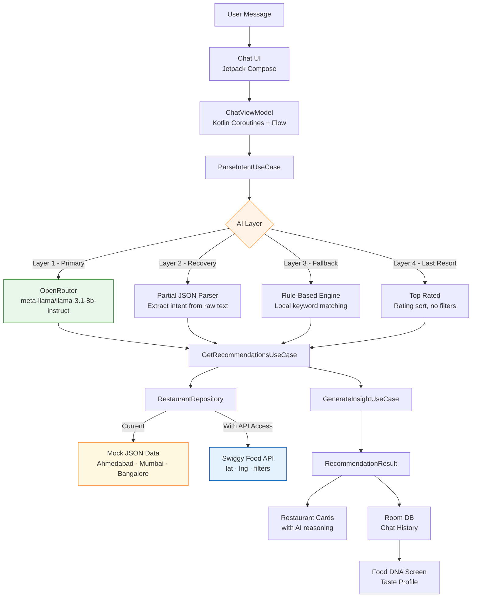

# SwiggyMind 🧠

> An AI ordering copilot that understands what you're craving  not just what you type.

<p align="center">
  
</p>

<p align="center">
  
  
  
  
  
</p>

---

## The Problem

Swiggy today requires you to already know what you want. You browse, filter manually, scroll endlessly. SwiggyMind flips this entirely.

Tell it what you're feeling. It reasons its way to a recommendation  with an explanation.

```
"Something light, not too oily, under ₹180"        →  3 ranked picks with reasoning
"Grocery list for biryani for 4 people"             →  Parsed ingredient list + Instamart link  
"Book a table for two this evening, rooftop"        →  Dineout recommendations with context
```

---

## What Makes It Different

| Swiggy Today | SwiggyMind |
|---|---|
| Browse by cuisine or restaurant | Describe your craving in natural language |
| Manual filters for price, diet, time | Intent is parsed automatically |
| See a list, decide yourself | Get ranked picks with AI reasoning |
| No memory of your preferences | Builds your Food DNA over time |

---

## Architecture



---

## AI Layer  4-Layer Response Guarantee

SwiggyMind **never** shows an error message. Every query returns a useful result.

```
┌─────────────────────────────────────────────────────┐
│  Layer 1 — OpenRouter LLM (Primary)                 │
│  meta-llama/llama-3.1-8b-instruct:free              │
│  Timeout: 8 seconds                                 │
│  Badge shown: 🟠 AI-Powered                         │
├─────────────────────────────────────────────────────┤
│  Layer 2 — Partial Recovery                         │
│  LLM responded but JSON malformed                   │
│  Extracts restaurant names from raw text            │
│  Fuzzy matches against repository                   │
│  Badge shown: 🟠 AI-Powered                         │
├─────────────────────────────────────────────────────┤
│  Layer 3 — Rule-Based Fallback                      │
│  No LLM available                                   │
│  Local keyword parsing → repository filters         │
│  Sort by rating, apply delivery/budget constraints  │
│  Badge shown: ⚪ Top Rated                          │
├─────────────────────────────────────────────────────┤
│  Layer 4 — Last Resort                              │
│  All filters returned 0 results                     │
│  Relax all constraints, return top 3 by rating      │
│  Badge shown: ⚪ Top Rated                          │
└─────────────────────────────────────────────────────┘
```

This architecture means the AI is a **progressive enhancement**, not a dependency. The app works perfectly offline.

---

## Tech Stack

```
┌─────────────────────────────────────────────────────┐
│  Presentation                                       │
│  Jetpack Compose · Material 3 · Plus Jakarta Sans   │
│  Animated transitions · Coil image loading          │
├─────────────────────────────────────────────────────┤
│  Architecture                                       │
│  Clean Architecture · MVVM · KMP shared module      │
│  Kotlin Coroutines · StateFlow · Result<T>          │
├─────────────────────────────────────────────────────┤
│  Data                                               │
│  Room (chat history · sessions · Food DNA)          │
│  Ktor (OpenRouter HTTP client)                      │
│  kotlinx.serialization (JSON parsing)               │
│  DataStore (preferences)                            │
├─────────────────────────────────────────────────────┤
│  AI                                                 │
│  OpenRouter free tier (no credit card required)     │
│  Local rule-based fallback engine                   │
│  Intent parsing with structured JSON output         │
├─────────────────────────────────────────────────────┤
│  DI · Build                                         │
│  Hilt · Gradle version catalogs · GitHub Actions    │
└─────────────────────────────────────────────────────┘
```

---

## Module Structure

```
SwiggyMind/
├── androidApp/
│   ├── ui/
│   │   ├── chat/          # ChatScreen, ChatViewModel
│   │   ├── history/       # HistoryScreen
│   │   ├── fooddna/       # FoodDnaScreen
│   │   └── theme/         # Color, Typography, Theme
│   └── di/                # Hilt modules
│
└── shared/
    └── commonMain/
        ├── data/
        │   ├── model/     # Restaurant, MenuItem, ChatSession
        │   ├── repository/ # RestaurantRepository, SessionRepository
        │   └── source/
        │       ├── local/  # Mock JSON, Room DAOs
        │       └── remote/ # OpenRouterClient
        ├── domain/
        │   ├── model/     # UserIntent, RecommendationResult, FoodDna
        │   └── usecase/   # ParseIntent, GetRecommendations,
        │                  # GenerateInsight, SaveSession
        └── ai/
            ├── LLMClient.kt
            ├── OpenRouterClient.kt
            └── RuleBasedEngine.kt
```

---

## Features

### Conversational Food Discovery
Natural language input parsed into structured intent — cuisine, budget, dietary preference, spice level, occasion, party size.

### Food DNA
After 3+ conversations, SwiggyMind builds a personal taste profile from your history — spice tolerance, diet preference, average budget, ordering patterns, top cuisines. Shareable as a card.

### Smart Location
Detects your city via device location. Currently supports Ahmedabad, Mumbai, and Bangalore with curated mock data. Designed to swap to Swiggy's live Food API with a single repository change.

### Conversation History
Every session is persisted in Room with full recommendation data. Tap any history item to restore the complete conversation including restaurant cards — no re-querying needed.

### Response Resilience
4-layer fallback guarantee. The app never shows an error. Offline mode works via rule-based engine with no network required.

---

 

```bash
git clone https://github.com/rudradave1/SwiggyMind
cd SwiggyMind
```

Add your free OpenRouter key to `local.properties`:
```
OPENROUTER_API_KEY=sk-or-xxxxxxxxxxxxxxxx
```

Get a free key at [openrouter.ai](https://openrouter.ai)  no credit card required.

```bash
./gradlew :androidApp:assembleDebug
```

Install the APK on your device or emulator.

> The app works fully without an OpenRouter key  it falls back to the rule-based engine automatically.

---

## The Swiggy API Opportunity

SwiggyMind is currently built on mock data that mirrors Swiggy's restaurant schema exactly. With Builders Club API access, the upgrade path is a single repository change:

```kotlin
// Today  mock data
class RestaurantRepositoryImpl : RestaurantRepository {
    override suspend fun search(intent: UserIntent, city: String) =
        mockDataSource.filter(intent, city)          // ← replace this line
}

// With Swiggy Food API
class RestaurantRepositoryImpl : RestaurantRepository {
    override suspend fun search(intent: UserIntent, location: LatLng) =
        swiggyApiSource.search(                      // ← with this
            lat = location.lat,
            lng = location.lng,
            cuisine = intent.cuisine,
            maxPrice = intent.maxBudget,
            veg = intent.dietaryPreference == "veg"
        )
}
```

The AI layer, intent parsing, conversation history, Food DNA  all of it works identically with live data.

---

## Why This Gets Built on Swiggy

Swiggy has the inventory. The ratings. The delivery network. The real-time availability data. SwiggyMind provides the conversational layer that turns all of that into answers instead of options.

The combination  Swiggy's data × natural language intent  is a product that doesn't exist today and should.

---

## Built by

**Rudra Dave**  Senior Android Engineer · 6 years · Kotlin · KMP · Jetpack Compose

[](https://linkedin.com/in/rudradave)
[](https://github.com/rudradave1)

Interested in joining Swiggy? So am I.

---

## License

```
MIT License  use freely, build something great.
```

<p align="center">
  <sub>Built for Swiggy Builders Club · Not an official Swiggy product</sub>
</p>
