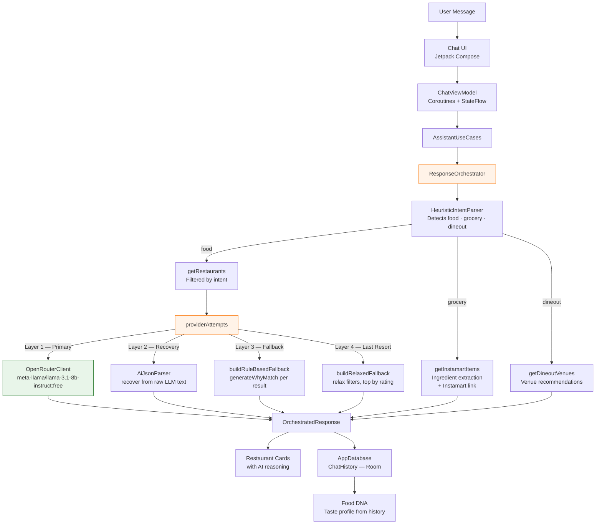

# SwiggyMind 🧠

> An AI ordering copilot that understands what you're craving — not just what you type.

<p align="center">
  
</p>

<p align="center">
  
  
  
  
  
  
</p>

---

## The Problem

Swiggy today requires you to already know what you want. You browse, filter manually, scroll endlessly. SwiggyMind flips this entirely.

Tell it what you're feeling. It reasons its way to a recommendation — with an explanation.

```
"Something light, not too oily, under ₹180"        →  3 ranked picks with reasoning
"Grocery list for biryani for 4 people"             →  Parsed ingredient list + Instamart link
"Book a table for two this evening, rooftop"        →  Dineout recommendations with context
```

---

## What Makes It Different

| Swiggy Today | SwiggyMind |
|---|---|
| Browse by cuisine or restaurant | Describe your craving in natural language |
| Manual filters for price, diet, time | Intent parsed automatically |
| See a list, decide yourself | Ranked picks with AI reasoning |
| No memory of your preferences | Builds your Food DNA over time |

---

## Architecture



---

## AI Layer — 4-Layer Response Guarantee

SwiggyMind **never** shows an error message. `ResponseOrchestrator` ensures every query returns a useful result.

```
┌─────────────────────────────────────────────────────┐
│  Layer 1 — OpenRouterClient (Primary)               │
│  meta-llama/llama-3.1-8b-instruct:free              │
│  Timeout: 8 seconds via withTimeoutOrNull           │
│  Badge shown: 🟠 AI-Powered                         │
├─────────────────────────────────────────────────────┤
│  Layer 2 — AiJsonParser Recovery                    │
│  LLM responded but JSON malformed                   │
│  recoverFromRawResponses — ID match, name match,    │
│  fuzzy token scoring against restaurant pool        │
│  Badge shown: 🟠 AI-Powered                         │
├─────────────────────────────────────────────────────┤
│  Layer 3 — buildRuleBasedFallback                   │
│  No LLM available                                   │
│  HeuristicIntentParser filters → sort by rating     │
│  generateWhyMatch builds specific reason per card   │
│  Badge shown: ⚪ Top Rated                          │
├─────────────────────────────────────────────────────┤
│  Layer 4 — buildRelaxedFallback                     │
│  Filters returned 0 results                         │
│  Relaxes constraints, top 3 by rating from all      │
│  Badge shown: ⚪ Top Rated                          │
└─────────────────────────────────────────────────────┘
```

The AI is a **progressive enhancement**, not a dependency. The app works fully offline via `HeuristicIntentParser`.

---

## Tech Stack

```
┌─────────────────────────────────────────────────────┐
│  Presentation                                       │
│  Jetpack Compose · Material 3 · Plus Jakarta Sans  │
│  Animated transitions · Coil image loading          │
├─────────────────────────────────────────────────────┤
│  Architecture                                       │
│  Clean Architecture · MVVM · KMP shared module      │
│  Kotlin Coroutines · StateFlow · Result<T>          │
├─────────────────────────────────────────────────────┤
│  Shared Module (commonMain)                         │
│  ResponseOrchestrator — 4-layer fallback chain      │
│  HeuristicIntentParser — local intent parsing       │
│  AiSchemas — structured intent models               │
│  AiJsonParser — LLM response recovery               │
│  ConversationContext — multi-turn context mgmt      │
│  AiConnectivityChecker — live status detection      │
├─────────────────────────────────────────────────────┤
│  Data                                               │
│  AppDatabase (Room) · ChatHistory entities          │
│  RestaurantRepository · SettingsRepository          │
│  OpenRouterClient (Ktor)                            │
│  kotlinx.serialization                              │
├─────────────────────────────────────────────────────┤
│  DI · Build                                         │
│  Hilt · SharedComponent · Gradle version catalogs  │
│  GitHub Actions CI                                  │
└─────────────────────────────────────────────────────┘
```

---

## Shared Module Structure

```
shared/src/commonMain/kotlin/com/rudra/swiggymind/
│
├── ai/
│   ├── AiConnectivityChecker.kt   # Live OpenRouter status detection
│   ├── AiJsonParser.kt            # LLM response recovery + parsing
│   ├── AiSchemas.kt               # Structured intent models
│   ├── ConversationContext.kt     # Multi-turn context trimming
│   ├── HttpClientFactory.kt       # Ktor client setup
│   ├── LLMClient.kt               # LLM interface
│   └── OpenRouterClient.kt        # OpenRouter implementation
│
├── data/
│   ├── local/
│   │   ├── AppDatabase.kt         # Room database
│   │   └── ChatHistory.kt         # Conversation persistence
│   └── repository/
│       └── RestaurantRepository.kt # Interface + mock impl
│                                   # ← all 3 MCP integration points
│
├── domain/
│   ├── repository/
│   │   └── SettingsRepository.kt
│   └── usecase/
│       ├── AssistantUseCases.kt
│       ├── HeuristicIntentParser.kt
│       └── ResponseOrchestrator.kt
│
└── AppConstants.kt
```

---

## The MCP Integration Points

`RestaurantRepository` is the single boundary between SwiggyMind and Swiggy's data. It already exposes exactly the three methods Swiggy's MCP servers map to:

```kotlin
interface RestaurantRepository {
    // → Swiggy Food MCP
    suspend fun getRestaurants(intent: UserIntent? = null): List<Restaurant>

    // → Swiggy Instamart MCP
    suspend fun getInstamartItems(intent: UserIntent? = null): List<InstamartItem>

    // → Swiggy Dineout MCP
    suspend fun getDineoutVenues(intent: UserIntent? = null): List<Restaurant>

    suspend fun getRestaurantById(id: String): Restaurant?
}
```

Today each method returns filtered mock JSON. With Builders Club API access, each method becomes a live MCP call — the `ResponseOrchestrator`, `HeuristicIntentParser`, `AiJsonParser`, and all four fallback layers continue working identically. No other files change.

---

## Features

**Conversational Discovery**
Natural language parsed into structured intent — cuisine, budget, dietary preference, spice level, occasion, mood — via OpenRouter LLM with local `HeuristicIntentParser` fallback.

**Grocery Flow**
When `mealType == grocery`, `ResponseOrchestrator` routes to `getInstamartItems` and `extractIngredients`, returning a shopping list card with direct Instamart deep link. No restaurant cards shown.

**Food DNA**
After 3+ conversations, builds a personal taste profile from `ChatHistory` — spice tolerance, diet preference, average budget, ordering patterns, top cuisines. Fully local computation. Shareable as a card.

**Smart Location**
Detects city via device location. Currently supports Ahmedabad, Mumbai, and Bangalore with curated mock data. `UserIntent` already carries location context — passing live coordinates to Swiggy Food API requires no architectural change.

**Conversation History**
Every session persisted in `AppDatabase` with full `OrchestratedResponse`. Tap any history item to restore the complete conversation including restaurant cards — no re-querying.

**Response Resilience**
`ResponseOrchestrator` guarantees a result on every query. `isLlmOffline` flag drives UI state honestly — users see "Top Rated" not "AI-Powered" when the LLM is unavailable.

---

## Running Locally

```bash
git clone https://github.com/rudradave1/SwiggyMind
cd SwiggyMind
```

Add your free OpenRouter key to `local.properties` (never committed):
```
OPENROUTER_API_KEY=sk-or-xxxxxxxxxxxxxxxx
```

Get a free key at [openrouter.ai](https://openrouter.ai) — no credit card required.

```bash
./gradlew :androidApp:assembleDebug
```

> The app works fully without an OpenRouter key. `ResponseOrchestrator` falls back to `HeuristicIntentParser` automatically — all features remain functional.

---

## Built by

**Rudra Dave** — Senior Android Engineer · 6 years · Kotlin · KMP · Jetpack Compose

[](https://linkedin.com/in/rudradave)
[](https://github.com/rudradave1)

Interested in joining Swiggy? So am I.

---

<p align="center">
  <sub>Built for Swiggy Builders Club · Not an official Swiggy product</sub>
</p>
