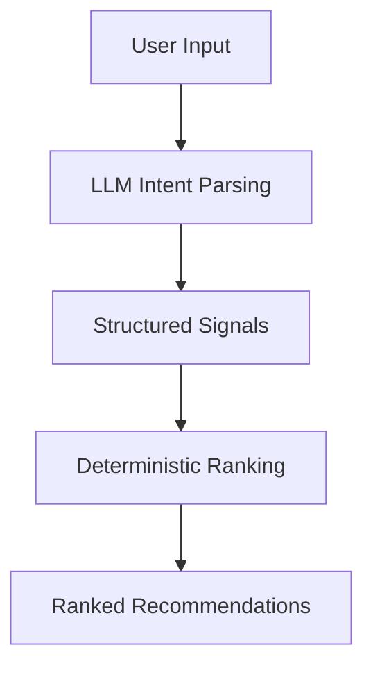

# SwiggyMind 🧠

AI-powered food ordering copilot for Android.

SwiggyMind translates natural language cravings into ranked, actionable restaurant recommendations — moving food discovery from browsing to decision-making.

  

  
  
  

---

## Problem

Food delivery apps are optimized for browsing, not intent.

Users think in constraints and preferences:
- “light dinner, high protein”
- “late-night comfort food”
- “something spicy but not oily”

But current systems require:
- manual filtering  
- scanning menus  
- trial-and-error decisions  

→ **High cognitive load between intent and outcome**

---

## Solution

SwiggyMind introduces an intent-driven layer on top of discovery.

Instead of searching, users describe what they want.

The system:
1. Interprets intent using an LLM  
2. Converts it into structured constraints  
3. Applies deterministic ranking  
4. Returns immediately actionable choices  

→ **Intent → structured reasoning → decision**

---

## System Design

### Intent → Structure → Ranking Pipeline

#### 1. Intent Parsing (LLM)
Transforms free-form input into structured signals:
- cuisine / taste preferences  
- dietary constraints  
- contextual signals (time, budget, mood)

---

#### 2. Deterministic Ranking Layer
Applies scoring on top of structured intent:
- relevance to extracted preferences  
- delivery constraints (time, cost)  
- quality signals  

This layer ensures:
> **consistent output on top of probabilistic LLM interpretation**

---

#### 3. Response Generation
- Produces ranked, high-confidence recommendations  
- Optimized for fast decision-making, not exploration  

---

#### 4. Resilience Strategy
- LLM (OpenRouter) → fallback heuristic ranking  
- Structured responses enforced via JSON schema  

---

## Example

**Input**
light dinner, high protein, vegetarian

**Output**
- Paneer-based meal options  
- High-protein vegetarian combinations  
- Restaurants optimized for quick delivery  

---

## Tech Stack

- Kotlin Multiplatform (shared logic)  
- Jetpack Compose (UI)  
- Ktor Client  
- OpenRouter (LLM inference)  
- Clean Architecture  
- Local persistence for session context  

---

## Architecture Overview

Engineering Focus
Separating probabilistic AI from deterministic decision layers
Translating unstructured input into structured system signals
Building AI features that improve real user workflows
Keeping architecture modular, testable, and extensible
Why This Matters

Most AI demos stop at text generation.

SwiggyMind focuses on:

decision systems, not generation
intent modeling, not keyword search
production-style architecture, not prototypes
Status

Built for Swiggy Builders Club.
Actively evolving.

Author

Rudra Dave
Senior Android & Kotlin Multiplatform Engineer

--- 
