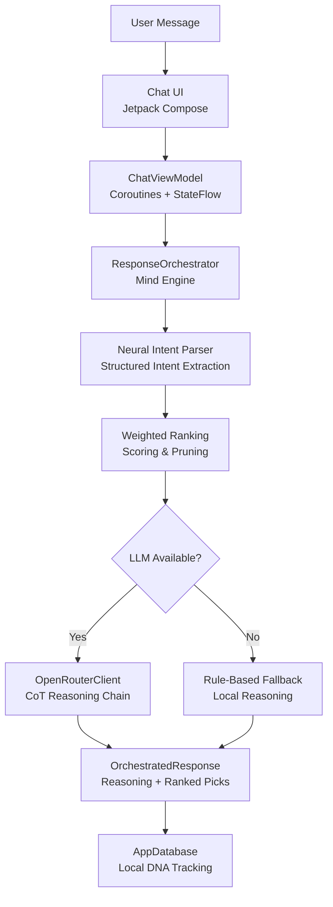

# SwiggyMind 🧠

> A Context-Aware Reasoning Engine for Hyper-Personalized Food Discovery.

  

  
  
  
  

Built for the **Swiggy Builders Club**, SwiggyMind moves beyond simple search. It implements an intelligence layer that understands user intent, reasons through options, and surfaces recommendations with undeniable logic.

---

## 🚀 Key Engineering Highlights

### 1. Neural Intent Parser
Unlike traditional keyword search, SwiggyMind uses an **LLM-powered Neural Intent Parser**. It extracts high-fidelity structured data (JSON) from natural language, identifying:
- **Flavor Profiles**: Spicy, mild, healthy, indulgent.
- **Contextual Logistics**: Budget constraints, delivery speed, group size.
- **Mood Analysis**: Comfort food vs. adventurous dining.

### 2. Cognitive Mind Engine (Ranking System)
Implemented a **Weighted Ranking Algorithm** that scores restaurant candidates before they reach the AI.
- **DNA Fit (40%)**: Historical user preference alignment.
- **Intent Match (30%)**: Real-time craving satisfaction.
- **Operational Metrics (30%)**: Ratings, delivery time, and cost optimization.

### 3. Session Memory & Chain of Thought (CoT)
- **Memory Layer**: Stores and retrieves previous interactions to build a "Food DNA" profile, which is injected into the AI's system prompt for personalized reasoning.
- **Reasoning Transparency**: Every recommendation includes a **Cognitive Reasoning** chain, showing the AI's internal logic for its selection. Reduced hallucinations via structured prompting and self-correction.

### 4. Robust Hybrid Architecture
- **Multi-Layer Response Strategy**: Cloud LLM (OpenRouter) → Rule-based Ranking → Heuristic Fallback.
- **Structured Discovery**: Enforced JSON schemas ensure consistent UI rendering and zero-hallucination results.

---

## 🛠 Tech Stack
- **Multiplatform**: Kotlin Multiplatform (KMP), Compose Multiplatform.
- **Persistence**: Room KMP (Chat History, Food DNA).
- **Networking**: Ktor Client with content negotiation.
- **AI Integration**: OpenRouter API with custom **Chain-of-Thought (CoT)** prompting.
- **DI**: Hilt (Android) & Manual Injection (Shared).

---

## 📖 Architecture Deep Dive

---

## 📊 Food DNA & Personalization
SwiggyMind builds a local **Taste Fingerprint** from your conversation history.
- **Spice tolerance**: Tracking explicit spice requests.
- **Dietary Style**: Mapping veg/non-veg/vegan trends.
- **Budget Sensitivity**: Analyzing historical price-point selections.

This DNA is injected into the AI's context, making the "Mind" truly yours over time.

---

## 👨‍💻 Built by
**Rudra Dave** — Senior Android Engineer
*Dedicated to building the next generation of food discovery at Swiggy.*

---
Built for Swiggy Builders Club · Not an official Swiggy product
