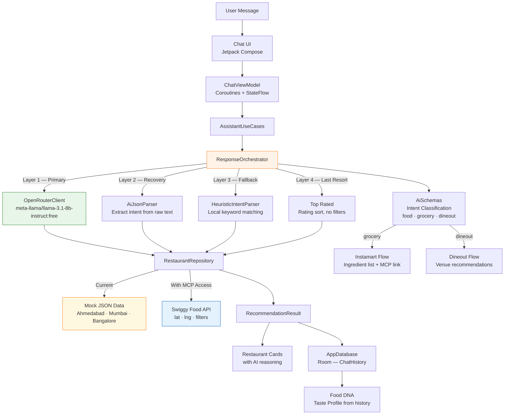

# SwiggyMind 🧠

> An AI ordering copilot that understands what you're craving  not just what you type.

<p align="center">
  
</p>

<p align="center">
  
  
  
  
  
</p>

---

## The Problem

Swiggy today requires you to already know what you want. You browse, filter manually, scroll endlessly. SwiggyMind flips this entirely.

Tell it what you're feeling. It reasons its way to a recommendation  with an explanation.

```
"Something light, not too oily, under ₹180"        →  3 ranked picks with reasoning
"Grocery list for biryani for 4 people"             →  Parsed ingredient list + Instamart link
"Book a table for two this evening, rooftop"        →  Dineout recommendations with context
```

---

## What Makes It Different

| Swiggy Today | SwiggyMind |
|---|---|
| Browse by cuisine or restaurant | Describe your craving in natural language |
| Manual filters for price, diet, time | Intent parsed automatically |
| See a list, decide yourself | Ranked picks with AI reasoning |
| No memory of your preferences | Builds your Food DNA over time |

---

## Architecture



---

## AI Layer : 4-Layer Response Guarantee

SwiggyMind **never** shows an error message. Every query returns a useful result.

```
┌─────────────────────────────────────────────────────┐
│  Layer 1 — OpenRouterClient (Primary)               │
│  meta-llama/llama-3.1-8b-instruct:free              │
│  Timeout: 8 seconds                                 │
│  Badge shown: 🟠 AI-Powered                         │
├─────────────────────────────────────────────────────┤
│  Layer 2 — AiJsonParser Recovery                    │
│  LLM responded but JSON malformed                   │
│  Extracts intent fragments from raw text            │
│  Fuzzy matches against repository                   │
│  Badge shown: 🟠 AI-Powered                         │
├─────────────────────────────────────────────────────┤
│  Layer 3 — HeuristicIntentParser                    │
│  No LLM available                                   │
│  Local keyword parsing → repository filters         │
│  Sort by rating, apply delivery/budget constraints  │
│  Badge shown: ⚪ Top Rated                          │
├─────────────────────────────────────────────────────┤
│  Layer 4 — Last Resort                              │
│  All filters returned 0 results                     │
│  Relax all constraints, return top 3 by rating      │
│  Badge shown: ⚪ Top Rated                          │
└─────────────────────────────────────────────────────┘
```

The AI is a **progressive enhancement**, not a dependency. The app works fully offline.

---

## Tech Stack

```
┌─────────────────────────────────────────────────────┐
│  Presentation                                       │
│  Jetpack Compose · Material 3 · Plus Jakarta Sans  │
│  Animated transitions · Coil image loading          │
├─────────────────────────────────────────────────────┤
│  Architecture                                       │
│  Clean Architecture · MVVM · KMP shared module      │
│  Kotlin Coroutines · StateFlow · Result<T>          │
├─────────────────────────────────────────────────────┤
│  Shared Module (commonMain)                         │
│  ResponseOrchestrator — 4-layer fallback chain      │
│  HeuristicIntentParser — local intent parsing       │
│  AiSchemas — structured intent models               │
│  AiJsonParser — LLM response recovery               │
│  ConversationContext — multi-turn context mgmt      │
│  AiConnectivityChecker — live status detection      │
├─────────────────────────────────────────────────────┤
│  Data                                               │
│  AppDatabase (Room) · ChatHistory entities          │
│  RestaurantRepository · SettingsRepository          │
│  OpenRouterClient (Ktor)                            │
│  kotlinx.serialization                              │
├─────────────────────────────────────────────────────┤
│  DI · Build                                         │
│  Hilt · SharedComponent · Gradle version catalogs  │
│  GitHub Actions CI                                  │
└─────────────────────────────────────────────────────┘
```

---

## Shared Module Structure

```
shared/src/commonMain/kotlin/com/rudra/swiggymind/
│
├── ai/
│   ├── AiConnectivityChecker.kt   # Live OpenRouter status detection
│   ├── AiJsonParser.kt            # LLM response recovery + parsing
│   ├── AiSchemas.kt               # Structured intent models (food/grocery/dineout)
│   ├── ConversationContext.kt     # Multi-turn context management
│   ├── HttpClientFactory.kt       # Ktor client setup
│   ├── LLMClient.kt               # LLM interface
│   └── OpenRouterClient.kt        # OpenRouter implementation
│
├── data/
│   ├── local/
│   │   ├── AppDatabase.kt         # Room database
│   │   └── ChatHistory.kt         # Conversation persistence
│   └── repository/
│       └── RestaurantRepository.kt # ← single MCP integration point
│
├── domain/
│   ├── model/
│   │   └── DomainModels.kt        # UserIntent, RecommendationResult, FoodDna
│   ├── repository/
│   │   └── SettingsRepository.kt
│   └── usecase/
│       ├── AssistantUseCases.kt       # Orchestrates the full query flow
│       ├── HeuristicIntentParser.kt   # Rule-based intent parsing
│       └── ResponseOrchestrator.kt    # 4-layer fallback chain
│
└── AppConstants.kt                # All constants — URLs, timeouts, thresholds
```

---

## The MCP Integration Point

SwiggyMind is architected so that Swiggy MCP access is a **single file change**:

```kotlin
// Today  mock data in RestaurantRepository.kt
override suspend fun search(intent: UserIntent, city: String) =
    mockDataSource.filter(intent, city)          // ← replace this

// With Swiggy Food MCP
override suspend fun search(intent: UserIntent, location: LatLng) =
    swiggyMcpSource.search(                      // ← with this
        lat = location.lat,
        lng = location.lng,
        cuisine = intent.cuisine,
        maxPrice = intent.maxBudget,
        veg = intent.dietaryPreference == "veg"
    )
```

`AiSchemas` already classifies intent into `food`, `grocery`, and `dineout`  routing to Instamart and Dineout MCP servers requires adding two call paths in `ResponseOrchestrator`, which already has the branching logic stubbed.

---

## Features

**Conversational Discovery**
Natural language parsed into structured intent  cuisine, budget, dietary preference, spice level, occasion, party size  via OpenRouter LLM with local `HeuristicIntentParser` fallback.

**Food DNA**
After 3+ conversations, builds a personal taste profile from `ChatHistory`  spice tolerance, diet preference, average budget, ordering patterns, top cuisines. Fully local computation. Shareable as a card.

**Smart Location**
Detects city via device location. Currently supports Ahmedabad, Mumbai, Bangalore with curated mock data. Designed to pass live coordinates to Swiggy Food API with no architectural change.

**Conversation History**
Every session persisted in `AppDatabase` with full `RecommendationResult`. Tap any history item to restore the complete conversation including restaurant cards  no re-querying.

**Response Resilience**
`ResponseOrchestrator` guarantees a useful result on every query. Offline mode works via `HeuristicIntentParser` with zero network required.

**Live AI Status**
`AiConnectivityChecker` reactively updates UI  green (OpenRouter live), yellow (smart defaults), red (offline). Users always know what mode the app is in.

---

## Running Locally

```bash
git clone https://github.com/rudradave1/SwiggyMind
cd SwiggyMind
```

Add your free OpenRouter key to `local.properties` (never committed):
```
OPENROUTER_API_KEY=sk-or-xxxxxxxxxxxxxxxx
```

Get a free key at [openrouter.ai](https://openrouter.ai)  no credit card required.

```bash
./gradlew :androidApp:assembleDebug
```

> The app works fully without an OpenRouter key. `ResponseOrchestrator` falls back to `HeuristicIntentParser` automatically  all features remain functional.

---

## Built by

**Rudra Dave** — Senior Android Engineer · 6 years · Kotlin · KMP · Jetpack Compose

[](https://linkedin.com/in/rudradave)
[](https://github.com/rudradave1)

Interested in joining Swiggy? So am I.

---

<p align="center">
  <sub>Built for Swiggy Builders Club · Not an official Swiggy product</sub>
</p>
